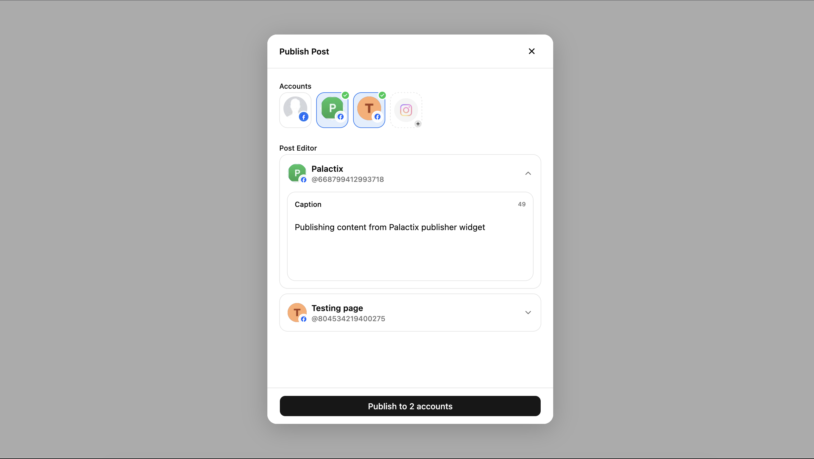

# @palactix/publisher-widget

[](https://www.npmjs.com/package/@palactix/publisher-widget)
[](https://www.npmjs.com/package/@palactix/publisher-widget)
[](LICENSE)

>Embed social media publishing into your own product — using your own platform credentials (BYOK).

The **Palactix Publisher Widget** allows you to schedule and publish social media posts directly from your own website, CMS, or dashboard — while keeping full ownership of your OAuth connections.

---

## Preview



Embed publishing directly into your own dashboard — under **your brand**, not a vendor's.

---

## Quick Start

### Option 1 — npm (Recommended)

```bash
npm install @palactix/publisher-widget
```

```js
import { init } from '@palactix/publisher-widget';

// Call once on page load — pre-loads the iframe in the background
const widget = init({ token: '<YOUR_INIT_TOKEN>' });

document.getElementById('publish-btn').addEventListener('click', () => {
  widget.publish();
});
```

### Option 2 — CDN

```html
<script src="https://cdn.jsdelivr.net/npm/@palactix/publisher-widget@latest/dist/iife/loader.min.js"></script>
<script>
  // Call once on page load — pre-loads the iframe in the background
  const widget = PalactixWidget.init({ token: '<YOUR_INIT_TOKEN>' });

  document.getElementById('publish-btn').addEventListener('click', () => {
    widget.publish();
  });
</script>
```

---

## Get Your Credentials

Before using the widget, you need to create your application and generate credentials.

This follows the **BYOK (Bring Your Own Keys)** model — meaning you use **your own platform apps**, not shared vendor credentials.

### Setup Steps

1. Create a developer account  
   https://palactix.com/developer/signup  

2. Create a new app  
   https://palactix.com/developer/apps  

3. Add your platform credentials  
   (Facebook, Instagram, LinkedIn, X, etc.)

4. Enable publisher widget and generate credentials

📘 Step-by-step guide:  
https://palactix.com/docs/getting-started/create-developer-app

---

### First-Time Setup Flow

Developer → Create App → Add Platform Credentials → Enable Widget → Initialize Widget

---

## Minimal Working Example

Smallest working setup:

```html
<!DOCTYPE html>
<html lang="en">
<head>
  <meta charset="UTF-8" />
  <title>My App</title>
</head>
<body>
  <button id="publish-btn">Publish Post</button>

  <script src="https://cdn.jsdelivr.net/npm/@palactix/publisher-widget@latest/dist/iife/loader.min.js"></script>
  <script>
    // 1. Fetch init token from your backend (never generate it in the browser)
    fetch('/api/publisher-token')
      .then(function(res) { return res.json(); })
      .then(function(data) {
        // 2. init() pre-loads the iframe — call this once on page load
        var widget = PalactixWidget.init({
          token: data.token,
          onPublished: function(post) { console.log('Published:', post); },
        });

        // 3. Your button opens the panel
        document.getElementById('publish-btn').addEventListener('click', function() {
          widget.publish();
        });
      });
  </script>
</body>
</html>
```

This example opens the publisher with basic configuration.

---

## Why BYOK Matters


| **Aspect** | **Traditional Publishing Tools** | **Palactix BYOK Model** |
|-----------|----------------------------------|--------------------------|
| **OAuth Ownership** | Vendor owns OAuth connections | You use **your own platform credentials** |
| **Authorization Branding** | Vendor name appears during authorization | Your **brand appears** during authorization |
| **Tool Switching** | Switching tools requires reconnecting users | Connections remain **portable** |
| **Vendor Dependency** | Vendor lock-in is unavoidable | **No vendor lock-in** |

**You own the connection — not the vendor.**

---

## Generating the Init Token

Your **WIDGET_ID** and **WIDGET_SECRET** are available are [lived here](https://palactix.com/developer/apps)

The widget requires a **short-lived token generated from your backend**.

⚠️ Never generate tokens in frontend code.

Basic flow:

1. Your frontend requests token from backend  
2. Backend requests token from Palactix API  
3. Backend returns token to frontend  
4. Widget initializes using that token  

**Node.js / Express**
```js
// GET /api/publisher-token
app.get('/api/publisher-token', async (req, res) => {
  const basic = Buffer.from(
    `${process.env.WIDGET_ID}:${process.env.WIDGET_SECRET}`
  ).toString('base64');

  const response = await fetch('https://api.palactix.com/widget/tokens', {
    method: 'POST',
    headers: {
      'Content-Type': 'application/json',
      'Authorization': `Basic ${basic}`,
    },
    body: JSON.stringify({
      external_user_id: req.user.id, // stable ID from your auth system
      ttl: 300,                       // token valid for 5 minutes
    }),
  });

  const { init_token } = await response.json();
  res.json({ token: init_token });   // return as { token } to the frontend
});
```

**PHP**
```php
$basic = base64_encode(getenv('WIDGET_ID') . ':' . getenv('WIDGET_SECRET'));

$ctx = stream_context_create([
    'http' => [
        'method'        => 'POST',
        'header'        => implode("\r\n", [
            'Content-Type: application/json',
            'Authorization: Basic ' . $basic,
        ]),
        'content'       => json_encode([
            'external_user_id' => $userId,
            'ttl'              => 300,
        ]),
        'ignore_errors' => true,
    ],
]);

$data      = json_decode(file_get_contents('https://api.palactix.com/widget/tokens', false, $ctx), true);
$initToken = $data['init_token'];
// Return $initToken as JSON: { "token": "..." }
```

**Python**
```python
import os, base64, requests

credentials = base64.b64encode(
    f"{os.environ['WIDGET_ID']}:{os.environ['WIDGET_SECRET']}".encode()
).decode()

response = requests.post(
    'https://api.palactix.com/widget/tokens',
    headers={
        'Content-Type': 'application/json',
        'Authorization': f'Basic {credentials}',
    },
    json={
        'external_user_id': user_id,  # stable ID from your auth system
        'ttl': 300,
    },
    timeout=10,
)

init_token = response.json()['init_token']
# Return as JSON: { "token": init_token }
```

For full backend examples:

https://palactix.com/docs/publisher-widget/init-token

---

## API Reference

### init(config)

Initialize widget.

Configuration fields:
| **Parameter** | **Description** | **Required** |
|--------------|-----------------|--------------|
| `token` | Short-lived init token | Yes |
| `primary` | Theme color | No |
| `mode` | Modal or drawer display mode | No |
| `onReady` | Widget ready callback | No |
| `onPublished` | Publish success callback | No |
| `onClose` | Widget close callback | No |

Call `init()` once per page load.  
It pre-loads the publisher iframe in the background for faster opening.

---

### publish(preFill)

Open publishing interface.

```js
// Open with no pre-fill
widget.publish();

// Open with pre-filled caption and media
widget.publish({
  caption: 'Check out our latest update! 🚀',
  media: [
    {
      url: 'https://example.com/product-shot.jpg',
      type: 'image',
      alt_text: 'Product screenshot',
    },
  ],
});
```

---

### destroy()

Remove widget instance.

```js
// Removes the overlay, iframe, and all event listeners
widget.destroy();
```

---

## Supported Platforms

Currently supports:

- Facebook  
- Instagram  
- LinkedIn  
- Twitter / X  

More platforms added continuously.

---

## Troubleshooting

### Widget not opening

Check:

- Token is valid  
- Script loaded successfully  
- No console errors  

---

### Invalid token

Ensure:

- Token generated from backend  
- Token not expired  

---

## Security Notes

Always:

- Generate tokens on backend  
- Never store `WIDGET_SECRET` in frontend code or public repositories.
- Use short-lived tokens  
- Restrict allowed origins  

OAuth security is critical.

---

## Full Documentation

For advanced integration, configuration, and framework examples:

https://palactix.com/docs/publisher-widget

---

## License

MIT
